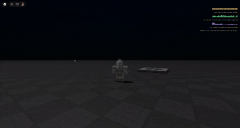

<p align="center">
  
</p>

<p align="center">
  Little Roblox typed command console for in-game admin commands, debug commands, and typed utilities.
</p>

<p align="center">
  <a href="#install">Install</a>
  ·
  <a href="#how-it-works">How It Works</a>
  ·
  <a href="#using-it">Using It</a>
  ·
  <a href="#commands">Commands</a>
  ·
  <a href="#api">API</a>
</p>

## What Is This?

Konsole is a typed compact command bar for Roblox games.

Konsole, gives you an in-game terminal for commands like `kick`, `bring`, `tp`, `ranks`, and your own custom commands. It handles suggestions, typed arguments, command history, result tables, client/server dispatch, ranks, and small UI details like two command panes and argument chips.

<p align="center">
  
</p>

## Install

Put `Konsole.rbxm` in `ReplicatedStorage/Packages/Konsole`, then require it.

```luau
local ReplicatedStorage = game:GetService("ReplicatedStorage")

local Konsole = require(ReplicatedStorage.Packages.Konsole)
```

For roblox-ts/npm:

```sh
npm install @kyrorblx/konsole
```

```ts
import Konsole = require("@kyrorblx/konsole");
```

For Wally:

```toml
[dependencies]
Konsole = "kyrorblx/konsole@0.1.9"
```

Konsole is shared, but the UI is client-side. The server hosts command execution. The client shows the command bar and forwards server commands through Konsole's remote bridge.

## How It Works

Konsole has three main pieces:

- `Kommand`: stores command definitions, schemas, aliases, suggestions, and argument metadata.
- `Dispatch`: parses text, checks rank/cooldown, converts arguments, and runs the right client or server implementation.
- `Render`: creates the client UI, suggestions, history, result output, and the command input.

The usual setup is:

1. Server calls `Konsole.host()`.
2. Client calls `Konsole.show()` or `Konsole.toggle()`.
3. Built-in commands register automatically.
4. Server command definitions replicate to clients so suggestions and argument hints work.
5. When a command has `server = "someServerName"`, the client forwards the text to the server.

Inline `run` commands can run where they are registered. Server commands should usually use `server = "name"` with `Konsole.implement("name", callback)` or pass implementations into `Konsole.host(...)`.

## Using It

Server setup:

```luau
local ReplicatedStorage = game:GetService("ReplicatedStorage")

local Konsole = require(ReplicatedStorage.Packages.Konsole)

Konsole.host()
```

Client setup:

```luau
local ReplicatedStorage = game:GetService("ReplicatedStorage")

local Konsole = require(ReplicatedStorage.Packages.Konsole)

Konsole.show()
```

By default, Konsole opens with `T`. You can change that:

```luau
Konsole.setActivationKeys({ Enum.KeyCode.Semicolon })
```

You can also toggle manually:

```luau
Konsole.toggle()
Konsole.show()
Konsole.hide()
Konsole.focus()
```

## Built-In Commands

Konsole ships with a few small commands:

- `cmds`: lists registered commands, rank, usage, and description
- `clear` / `cls`: clears the active Konsole chat pane
- `ranks`: lists known ranks
- `bring`: brings target players to you
- `tp`: teleports you to a target player
- `kick`: kicks a player
- `ban`: bans players from the current server
- `unban`: unbans a user ID from the current server
- `kill`: kills a player

The ban command is server-local. It blocks players for the lifetime of that server, not permanently across all servers. If you want persistent bans, store ban state in a DataStore and implement your own `banServer` / `unbanServer`.

## Commands

A command definition looks like this:

```luau
Konsole.define({
	name = "setscore",
	rank = 50,
	aliases = { "score" },
	description = "Sets the score.",
	server = "setScoreServer",
	args = {
		{
			name = "home",
			type = "number",
			required = true,
		},
		{
			name = "away",
			type = "number",
			required = true,
		},
	},
})
```

Then bind the server implementation:

```luau
Konsole.implement("setScoreServer", function(context, homeScore, awayScore)
	print(context.entity, homeScore, awayScore)
	return context.reply(`score set to {homeScore}-{awayScore}`)
end)
```

Or pass implementations straight into `host`:

```luau
Konsole.host({
	setScoreServer = function(context, homeScore, awayScore)
		return context.reply(`score set to {homeScore}-{awayScore}`)
	end,
})
```

Commands are normalized to lowercase internally. Aliases are normalized too.

## Client Commands

If a command has `run` and no `server`, it runs locally.

```luau
Konsole.define({
	name = "pinglocal",
	rank = 0,
	description = "Runs on this client.",
	run = function(context)
		return context.reply("pong")
	end,
})
```

Client commands are useful for UI toggles, local debug views, camera tools, graphics settings, or anything that only affects one player.

## Server Commands

If a command has `server`, Konsole forwards it to the server when typed by a client.

```luau
Konsole.define({
	name = "announce",
	rank = 50,
	description = "Sends a server announcement.",
	server = "announceServer",
	args = {
		{
			name = "message",
			type = "string",
			required = true,
		},
	},
})

Konsole.implement("announceServer", function(context, message)
	print(message)
	return context.reply("announced")
end)
```

The server is authoritative. Rank checks happen on the server before server commands run.

## Arguments

Arguments tell Konsole how to parse and display command inputs.

```luau
args = {
	{
		name = "target",
		type = "player",
		required = true,
		suggestions = { "me" },
	},
	{
		name = "reason",
		type = "string",
		required = false,
		default = "No reason provided.",
	},
}
```

Built-in types:

- `string`: plain text
- `number`: converted with `tonumber`
- `boolean`: accepts `true`, `false`, `yes`, `no`, `on`, `off`, `1`, `0`
- `player`: one player
- `players`: one or more players

Player shortcuts:

- `me`: the command caller
- `all` or `*`: every player
- `others`: every player except the caller

For `player`, the token must resolve to exactly one player. For `players`, it can resolve to many.

Konsole also uses argument metadata for the UI. When you type a command with args, it shows argument chips. Fixed-token args like `number` and `boolean` jump to the next chip when you press space. Bad argument types turn red while typing.

## Suggestions

Suggestions come from command names, aliases, and argument providers.

For a static list:

```luau
{
	name = "mode",
	type = "string",
	suggestions = { "easy", "normal", "hard" },
}
```

For player arguments, Konsole automatically suggests player names plus `me`, `all`, and `others`.

Use Tab to accept a suggestion. Use Up and Down to move through suggestions. Use Left and Right to move between structured argument chips when your cursor is at the edge of a chip.

## Results

Commands can return:

- `nil`: success
- a string/number/etc: success message
- a result table
- `context.reply(...)`
- `context.err(...)`

Basic success:

```luau
return context.reply("done")
```

Basic error:

```luau
return context.err("no-target", "No target player.")
```

Table result:

```luau
return {
	ok = true,
	kind = "table",
	title = "Players",
	message = "current server",
	width = "wide",
	columns = { "Name", "UserId" },
	rows = {
		{ Name = "kio", UserId = "123" },
	},
}
```

There are also helpers under `Konsole.Result`:

```luau
return Konsole.Result.ok("saved")
return Konsole.Result.err("bad-input", "That value is invalid.")
return Konsole.Result.table("Scores", { "Team", "Score" }, rows)
return Konsole.Result.status("State", {
	{ Field = "Round", Value = "2" },
	{ Field = "Alive", Value = "7" },
})
```

Successful results show with a checkmark. Errors show with an `x`.

## Running Commands Inside Commands

Every command gets a `context.run(...)` helper.

```luau
Konsole.define({
	name = "resetmatch",
	rank = 100,
	server = "resetMatchServer",
})

Konsole.implement("resetMatchServer", function(context)
	context.run("setscore 0 0")
	context.run("bring all")
	return context.reply("match reset")
end)
```

`context.run` runs through the normal dispatch path, so ranks, arguments, cooldowns, and server implementations still apply.

## Cooldowns

Commands can have a built-in cooldown:

```luau
Konsole.define({
	name = "daily",
	rank = 0,
	description = "Claims a daily reward.",
	server = "dailyServer",
	cooldown = 60,
})
```

The cooldown is in seconds. If a player tries to run the command early, Konsole returns a cooldown error with the remaining time.

Cooldowns are tracked per command and per caller in memory. They reset when the server restarts.

## Ranks

Every command has a rank. If no rank is provided, it is rank `0`.

Built-in rank names include:

- `player`: `0`
- higher built-in names can be inspected with `ranks`

Set a rank manually:

```luau
Konsole.setRank(player.UserId, 100)
```

Read a rank:

```luau
local rank = Konsole.getRank(player)
```

Bind your own rank resolver:

```luau
Konsole.bindRanks(function(entity)
	if entity and entity.UserId == game.CreatorId then
		return 100
	end

	return nil
end)
```

Return `nil` to fall back to the built-in rank store.

## Two Command Panes

Konsole supports a second chat pane.

Once opened, each pane can be dragged independently. This is useful when you want to compare outputs, keep one command result visible, or run commands without losing context in the first pane.

`clear` only clears the pane you typed it in. The public `Konsole.clear()` method clears the whole active client.

Konsole saves history, scroll positions, pane positions, and restored width when the UI is closed and reopened.

## UI Behavior

Konsole is intentionally small.

It opens as a compact pill near the bottom of the screen. When output appears, it expands into history. When command output is wider than the current panel, the panel grows to fit visible content. Command output slides upward when appended. Suggestions and argument hints animate in and out.

The command input uses structured chips for arguments so you can see what each value means while typing.

Useful keys:

- `T`: default toggle
- `Tab`: accept suggestion
- `Up` / `Down`: move through suggestions
- `Left` / `Right`: move between command/argument fields at the edges
- `Backspace`: return to the previous field at the start of an argument
- `Enter`: submit
- `Escape`: close

## Config

Pass config overrides into `Konsole.create(...)`.

```luau
local client = Konsole.create({
	input = {
		activationKeys = { Enum.KeyCode.Semicolon },
		forceclose = true, -- outside click fully closes instead of only releasing input focus
	},
	panel = {
		width = 280,
		outputWidth = 380,
		historyMaxHeight = 420,
	},
	color = {
		panel = Color3.fromRGB(0, 0, 0),
		inputText = Color3.fromRGB(255, 255, 255),
	},
})
```

Config groups:

- `font`
- `panel`
- `layout`
- `motion`
- `input`
- `color`
- `transparency`
- `commands`

Common panel options:

- `width`: base input width
- `outputWidth`: base width once history exists
- `maxWidth`: maximum width
- `height`: collapsed input height
- `historyMaxHeight`: max history height for each pane
- `suggestionHeight`
- `maxSuggestions`: maximum visible suggestions
- `suggestionGap`
- `displayOrder`

Common motion options:

- `expandSmoothTime`
- `openSmoothTime`
- `outputSmoothTime`
- `textFadeTime`
- `textSlideOffset`
- `itemSlideSmoothTime`
- `collapseSmoothTime`
- `hintFadeTime`
- `hintSlideTime`

Common color options:

- `panel`
- `inputText`
- `promptText`
- `suggPanel`
- `suggText`
- `successRich`
- `errorRich`
- `warnRich`
- `mutedText`

## Custom Clients

The direct `Konsole.show()` style uses one shared default client.

For more control:

```luau
local client = Konsole.create({
	input = {
		activationKeys = { Enum.KeyCode.F2 },
	},
})

client:bindRun(function(text)
	return Konsole.Dispatch.execute(text)
end)

client:setSuggestions(Konsole.Kommand.suggestions())
client:setSchemas(Konsole.Kommand.schemas())
client:show()
```

Most games can use the default client. Create a client when you want a different config, custom runner, or isolated UI behavior.

## API

```luau
Konsole.create(options?)
Konsole.host(serverImplementations?)

Konsole.define(definition)
Konsole.implement(name, callback)
Konsole.run(text)

Konsole.setRank(userId, rank)
Konsole.getRank(entity)
Konsole.bindRanks(resolver?)

Konsole.show()
Konsole.hide()
Konsole.toggle()
Konsole.focus()
Konsole.clear()
Konsole.destroy()

Konsole.setActivationKeys(keys)
Konsole.setEnabled(enabled)
Konsole.setActivationUnlocksMouse(enabled)
Konsole.setMouseUnlockDriver(getFn, setFn)
Konsole.getCursorTarget()
```

Client methods returned by `Konsole.create(...)`:

```luau
client:show()
client:hide()
client:toggle()
client:focus()
client:clear()
client:destroy()
client:bindRun(callback)
client:setSuggestions(list)
client:setSchemas(map)
client:setActivationKeys(keys)
client:setEnabled(enabled)
client:setActivationUnlocksMouse(enabled)
client:setMouseUnlockDriver(getFn, setFn)
client:getCursorTarget()
```

Command definition shape:

```luau
type Definition = {
	name: string,
	rank: number | string?,
	aliases: { string }?,
	args: { Argument }?,
	description: string?,
	cooldown: number?,
	server: string?,
	run: ((context, ...any) -> any)?,
}
```

Argument shape:

```luau
type Argument = {
	name: string?,
	type: string?,
	default: any,
	required: boolean?,
	suggestions: ({ string } | string)?,
}
```

Context shape:

```luau
type Context = {
	entity: Player?,
	kommand: Command,
	text: string,
	dispatch: Dispatch,
	ranks: Ranks,
	run: (text: any) -> any,
	reply: (message: any?) -> Outcome,
	err: (code: any?, message: any?) -> Outcome,
}
```
